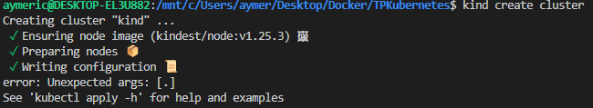
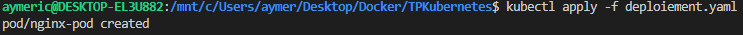
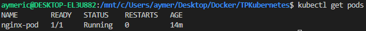

# TPKubernetes
2a\. On crée un cluster Kubernetes à l'aide de Kind : `kind create cluster`

Ensuite On crée un fichier deploiement.yaml pour le pod Nginx et on lance le deploiement du pod : `kubectl apply -f deploiement.yaml`

On peux vérifier que le pod Nginx est en cours d'exécution avec la commande suivante : `kubectl get pods`
