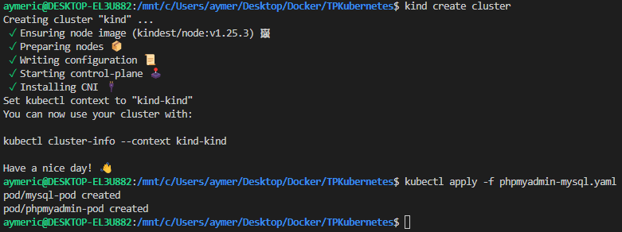
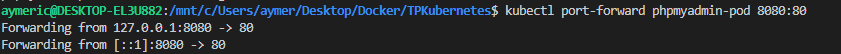
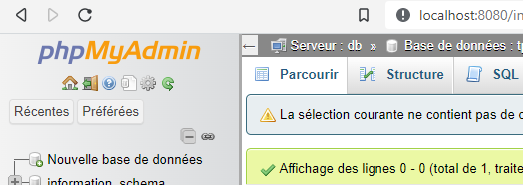

# TPKubernetes
2a\. On crée un cluster Kubernetes à l'aide de Kind : `kind create cluster`

Ensuite On crée un fichier deploiement.yaml pour le pod Nginx et on lance le deploiement du pod : `kubectl apply -f deploiement.yaml`

On peux vérifier que le pod Nginx est en cours d'exécution avec la commande suivante : `kubectl get pods`

----------------------------------------------------
2b\. grace à la commande precédente nous avons obtenu le nom du pod. Avec celui-ci, on peux accéder à la page par défaut de notre pod Nginx grace à cette command : `kubectl port-forward nginx-pod 8080:80`

Ainsi, la page d'acceuil Nginx est accessible sur http://localhost:8080

3. On crée les fichiers php-myadmin-mysql.yaml et my-sql-service.yaml et on execute les commande suivantes:
`kind create cluster`
`kubectl apply -f phpmyadmin-mysql.yaml`
`kubectl apply -f mysql-service.yaml`
`kubectl port-forward phpmyadmin-pod 8080:80`

Ainsi, on peux se connecter à phpmyadmin avec les identifiants corespondant aux variables d'environements sur http://localhost:8080
